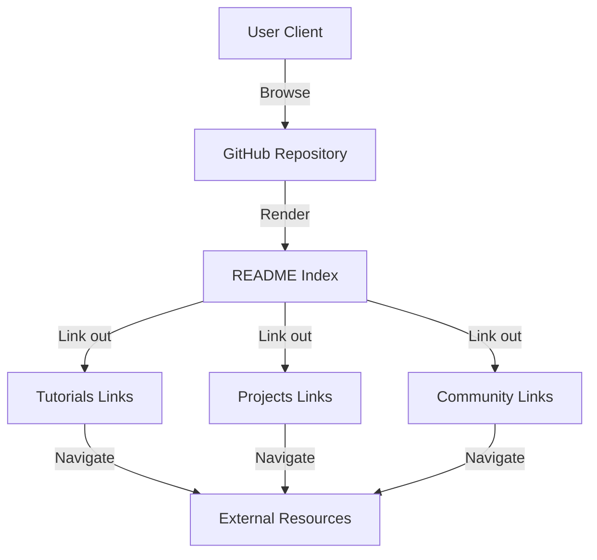

# awesome-deep-learning
*An opinionated, high-signal index of Deep Learning tutorials, projects, and community resources in one place.*

 

## Overview
`awesome-deep-learning` is a documentation-only repository that curates Deep Learning learning material into a single, navigable reference. Instead of shipping an executable codebase, it centralizes links to tutorials, projects, and community resources to reduce search time and improve discovery. The repository’s primary entry point is `README.md`, which acts as the index.

## System Architecture


## Tech Stack
| Category | Technologies |
|----------|-------------|
| Frontend |  |
| Infra    |  |

## Quick Start
Prereqs: A GitHub account and a Markdown viewer (GitHub web UI is enough).

```bash
git clone https://github.com/Dhathri19/awesome-deep-learning.git
cd awesome-deep-learning
# Open the curated index
cat README.md
# or open in your editor
code README.md
```

## Key Features
- Curated Deep Learning tutorials: a centralized set of learning links optimized for fast scanning and discovery.
- Project references: pointers to practical Deep Learning repositories and example implementations.
- Community and ecosystem links: gateways to forums, groups, and resource hubs to stay current.
- Zero build and zero runtime: no tooling, dependencies, CI, or Docker—just a clean `README.md` index.